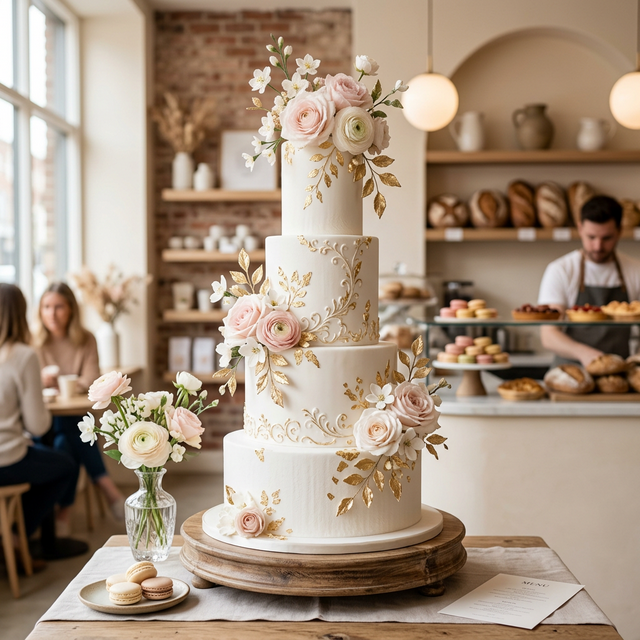

# 🍰 Dalton's Cakes



A beautiful, responsive front-end landing page for **Dalton's Cakes** (also known as Sweet Elevation), a premium artisanal cake bakery. 

**🌐 Live Demo:** [https://daltonbakes.vercel.app/](https://daltonbakes.vercel.app/)

## ✨ Features

- **Modern UI/UX**: Elegant design with premium colors (Warm Cream, Deep Chocolate, Gold Accent, Pastel Pink).
- **Responsive Layout**: Perfectly adapts to mobile, tablet, and desktop screens.
- **Animations**: Smooth scroll, fade-in-up animations, and hover effects.
- **Interactive Elements**: Sticky navigation with blur effect, mobile menu, and an inquiry form.

## 🛠️ Tech Stack

- **HTML5**
- **Tailwind CSS** (via CDN for rapid styling)
- **Alpine.js** (for lightweight interactive behavior like the mobile menu)
- **FontAwesome** (for icons)
- **Google Fonts** (Playfair Display & Montserrat)

## 🚀 Getting Started

To run this project locally, simply clone the repository and open `index.html` in your browser.

```bash
git clone https://github.com/ch-irax/Dalton_cake.git
```

No build step or server is required. You can simply open the file, though using a local development server like Live Server (VS Code extension) will provide the best experience.

## 📂 Project Structure

- `index.html`: The main landing page.
- `styles.css`: Custom CSS for animations and minor visual tweaks.
- `script.js`: Additional JavaScript logic.
- `pictures/*.png`: Various cake display images used across the site.

## 🧑‍💻 Author

Made with ❤️ by **Chirag**
